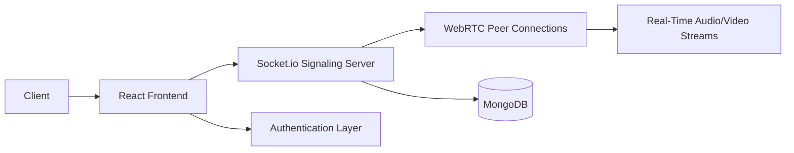

<div align="center">

# 🎥 LinkSync

### Real-Time Video Conferencing & Collaboration Platform

<p align="center">
  
  
  
  
  
</p>

<p align="center">
  Connect • Collaborate • Communicate
</p>

</div>

---

## 🚀 Overview

**LinkSync** is a real-time video conferencing platform that enables seamless communication through secure audio/video calls, live messaging, and collaborative virtual meeting rooms.

Built using modern web technologies, LinkSync focuses on low-latency communication, scalable architecture, and an intuitive user experience for remote collaboration.

---

## ✨ Features

### 🎥 Video Communication
- High-quality video conferencing
- Real-time audio communication
- Low-latency peer-to-peer connections
- Multiple participant support

### 💬 Real-Time Collaboration
- Live chat messaging
- Instant participant updates
- Meeting room management
- Interactive communication experience

### 🔐 Authentication & Security
- Secure user authentication
- Protected meeting rooms
- Session management
- User access control

### 📱 Responsive Experience
- Mobile Friendly
- Tablet Compatible
- Desktop Optimized
- Cross-Browser Support

### ⚡ Performance Optimization
- Real-time signaling
- Efficient WebRTC communication
- Optimized media streaming
- Reliable connection handling

---

## 🏗️ System Architecture



---

## 🛠️ Tech Stack

### Frontend
- React.js
- JavaScript
- HTML5
- CSS3

### Backend
- Node.js
- Express.js

### Database
- MongoDB

### Real-Time Communication
- WebRTC
- Socket.io

### Deployment
- Vercel
- Render

---

## 📊 Key Functionalities

- Create Meeting Rooms
- Join Existing Meetings
- Real-Time Video Calls
- Live Chat Messaging
- User Authentication
- Room-Based Collaboration
- Session Management

---

## 📂 Project Structure

```bash
LinkSync/
│
├── client/
│   ├── components/
│   ├── pages/
│   ├── hooks/
│   └── services/
│
├── server/
│   ├── controllers/
│   ├── routes/
│   ├── middleware/
│   └── socket/
│
├── screenshots/
│
├── README.md
│
└── package.json
```

---

## ⚙️ Installation

### Clone Repository

```bash
git clone https://github.com/your-username/linksync.git
```

### Install Dependencies

```bash
npm install
```

### Start Development Server

```bash
npm run dev
```

---

## 🎯 Software Engineering Concepts Applied

- Real-Time Communication
- Distributed Systems
- Networking Fundamentals
- Peer-to-Peer Architecture
- Scalable System Design
- WebSocket Communication
- Authentication & Security
- Performance Optimization

---

## 📚 Learning Outcomes

This project strengthened my understanding of:

- WebRTC
- Socket.io
- Real-Time Networking
- Full-Stack Development
- Software Design Principles
- Concurrent User Management
- Debugging Distributed Systems

---

## 👩‍💻 Author

### Umangi Patel

Software Engineering Enthusiast | MERN Stack Developer

GitHub: https://github.com/Umangi-webdev

---

<div align="center">

⭐ If you found this project useful, give it a star!

Building scalable real-time communication systems 🚀

</div>
